# 番茄小说竞品分析

##### @author：李卓翰

## 一、分析背景

### （一）、产品概况

##### 		1.产品概述及版本

​	番茄小说是一款免费网文阅读 APP，采用“广告+免费”的模式，为读者提供免费的精彩网文，提供畅快的阅读体验。支持在线阅读、离线下载、兴趣推荐、视频推书、有声书、阅读换金币等多项功能。

​	最新版本：4.0.5

##### 		2.测试环境

- 设备型号：IphoneX
- 操作系统：IOS14
- 测试网络：电信4G

##### 		3.选择理由

​	本人爱好阅读，网文有着十几年的历史，到现在互联网时代市场逐渐变得庞大，网文阅读也从曾经的一家独大到现在的各种模式的竞争，其中字节跳动入局移动阅读后，短短几个月便取得了日活过千万的壮举，便想要去做这款App的竞品分析作为产品经理的学习。

### （二）、市场分析

##### 		1.行业规模

​	2018年中国在线文学市场规模总计达153.5亿元，同比增长20.3%。自2015年以来，优质IP的出现成为产业内生动力，优化了产业发展结构。同时，国家出台了一系列打击网络侵权盗版的政策，并且国家陆续出台了《国家“十三五”时期文化发展改革规划纲要》、《关于开展2018年全民阅读工作的通知》等重大战略规划，并开展优秀网络文学原创作品推介等一系列活动。2019年《政府工作报告》“提倡全民阅读，推进学习型社会建设”。这一系列政策都推动着在线阅读的发展。

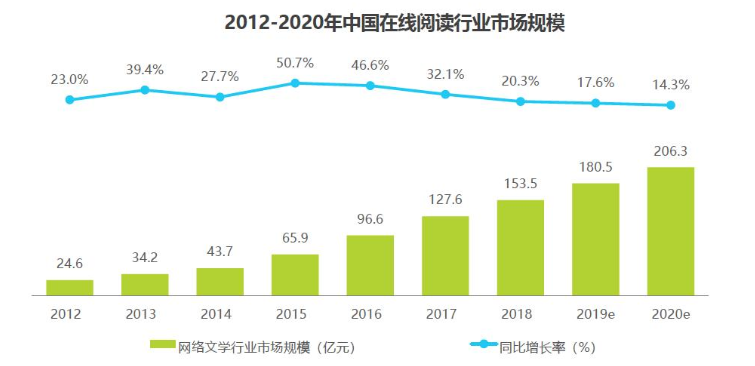

##### 		2.用户规模

​	2019年网络文学行业用户规模达4.7亿，同比增长8.8%，用户规模持续增长，在人口红利逐渐消退的影响下，在线阅读用户增长速度呈下降趋势，可预估2020-2021年，用户规模增长速度会进一步放缓，在线阅读行业的用户获得成本会变高。

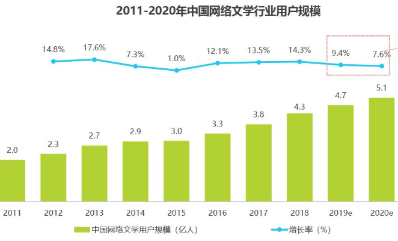

##### 		3.商业模式

​	在2018下半年，以七猫小说为代表的一批小说APP的崛起，另辟蹊径的开拓免费阅读的运营模式，这一模式使长尾作品有了更多接触用户的机会。不仅是对网络文学全新商业模式的创新开拓与有益探索，也为网文变现打开了一扇新的大门，对整个行业起到了意义非凡的推动作用。

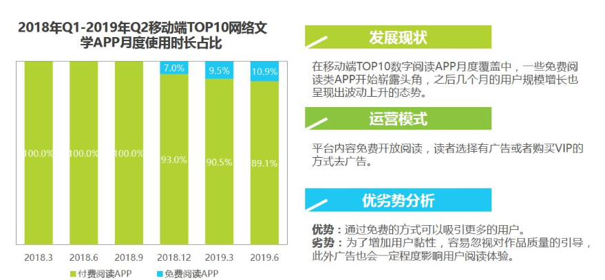

### （三）、用户分析

##### 		1.用户基本信息分析

​	中国数字阅读男女比例相差较大，男性用户偏多，为60.5%，且年龄方面有明显的偏向性，26-45岁年龄用户占比81%。用户普遍具有高学历，本科生及硕士生以上占比79.1%，高学历用户对于阅读的粘性较高。数字阅读用户管理者及中高级技术人员占比60.1%，具有较高的消费能力。根据以上数据分析得出2020年我国数字阅读产品用户普遍为男性，并且高学历成熟社会人群占比较大。

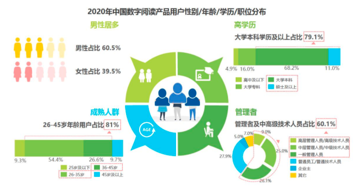

##### 2.用户画像

​	数字阅读产品用户平日休闲活动健康多元，最喜欢健身、看电影与演唱会，逛街购物，生活品质较高；在消费观方面，习惯主动搜索信息做功课，并倾向充当消费决策主导者的角色；在选品时，倾向于购买物有所值的品质商品。

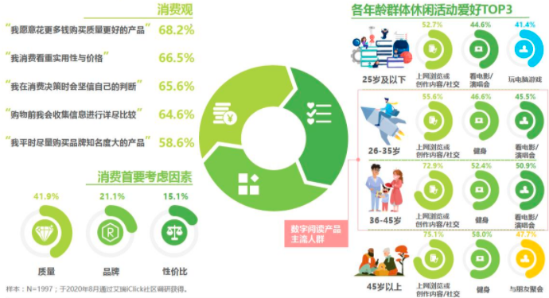

## 二、竞品对象

##### 	1.选择目标

七猫小说：

七猫免费小说是一款提供[小说阅读](https://baike.baidu.com/item/小说阅读/430636)服务的[软件](https://baike.baidu.com/item/软件/12053)。小说内容覆盖了总裁豪门小说、[言情小说](https://baike.baidu.com/item/言情小说/154757)、穿越架空小说、[玄幻小说](https://baike.baidu.com/item/玄幻小说/145698)、青春校园小说、修仙小说、[悬疑小说](https://baike.baidu.com/item/悬疑小说/5683700)、[同人小说](https://baike.baidu.com/item/同人小说/9824319)、名著等各种类型。

##### 	2.选择理由

通过数据对比发现，番茄小说和七猫小说目前在市场上都有较高的占有率，为阅读下载排行的第一名及第三名。对比两个平台在AppStore上的排名也较为接近，大幅领先其他的阅读软件，故选择七猫小说为直接竞品。

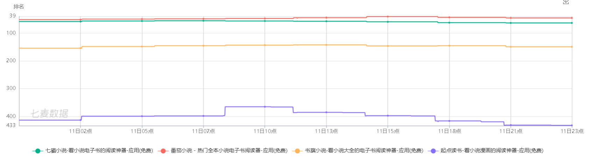

## 三、竞品分析

### （一）、定位和功能

##### 1.产品定位

|          | 番茄小说                                                     | 七猫小说                                                     |
| -------- | :----------------------------------------------------------- | ------------------------------------------------------------ |
| 官方介绍 | 番茄小说提供正版小说阅读，海量网络小说，让你看书不花钱，随时随地找到你想要的看到的。具有【海量精彩】、【兴趣推荐】、【听书畅读】 | 免费看书到永远，七猫免费小说，【海量小说免费看】、【排行精选找好书】 |
| 产品定位 | 免费网文阅读APP，采用“广告+免费”的模式，为读者提供免费的精彩网文，提供畅快的阅读体验，设计“福利"模式让用户赚取金币兑换现金奖励 | 正版免费小说阅读软件，聚合了海量优质小说，让用户尽情体验免费阅读的乐趣。看书的同时更有现金、金币奖励 |
| Slogan   | 免费好书，尽在番茄                                           | 免费看书100年，七猫免费小说                                  |

##### 2.产品功能

番茄小说功能思维导图

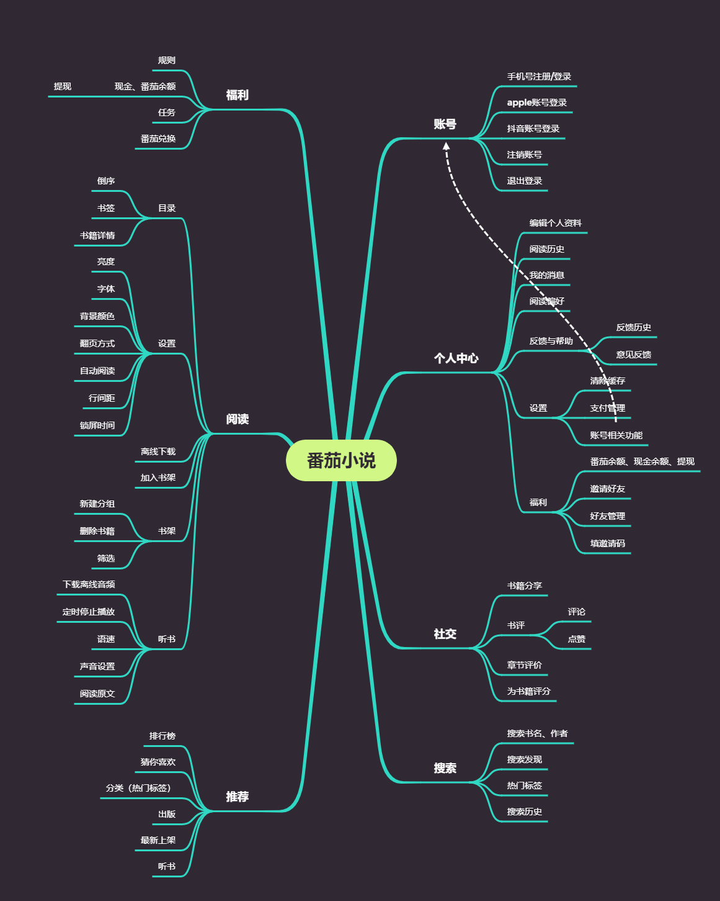

七猫小说功能思维导图

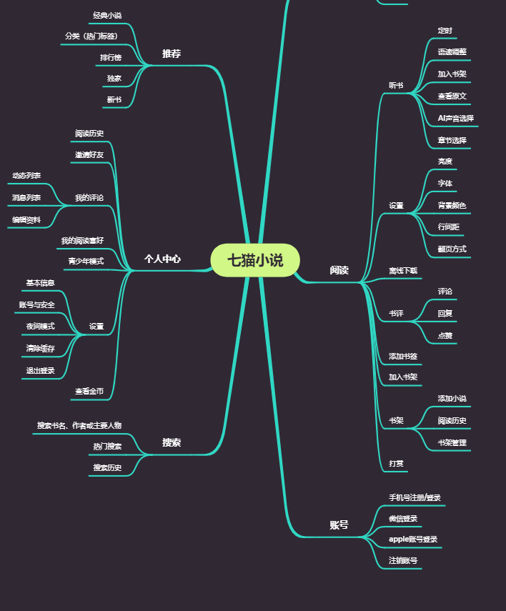

### （二）、设计和技术

##### 1.交互和体验

书籍介绍和书籍阅读是免费阅读小说的基本核心功能，其相关页面的交互对用户的使用体验造成最直接的影响，因此对这两个功能的交互进行分析。

    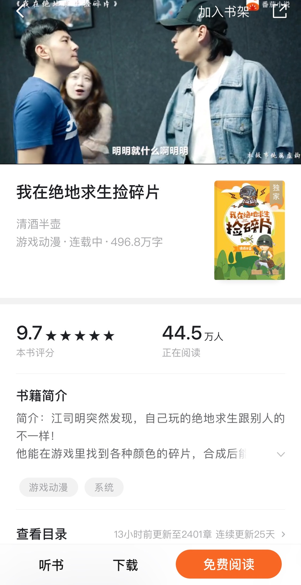
    
    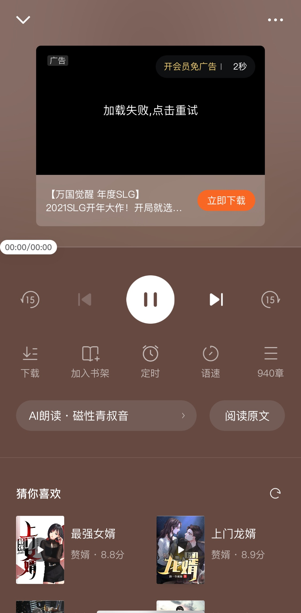

番茄小说与七猫小说做为行内的主要竞争对手，在书籍介绍信息页面的功能相差无几，都有书籍评分、阅读人数、书籍简介、查看目录、抢先阅读的功能。但番茄小说在书籍简介下方加了书籍标签功能，使用户可以在详细了解书籍内容前对书籍类别有大致的了解，并且可以点击相应的标签查看对应标签内的书籍内容，十分人性化，可快速看到想看标签下的图书，增加用户体验。最下方以及听书功能下方还有推荐其他书的功能，进一步拓展了书籍推荐的渠道，且放置位置合理，不会影响当前书籍的信息获取，因此不会造成读者的反感。番茄小说有独特的视频推书功能，利用短视频精炼、丰富的画面快速吸引用户。（书评功能番茄小说临时下架，故不作分析）

    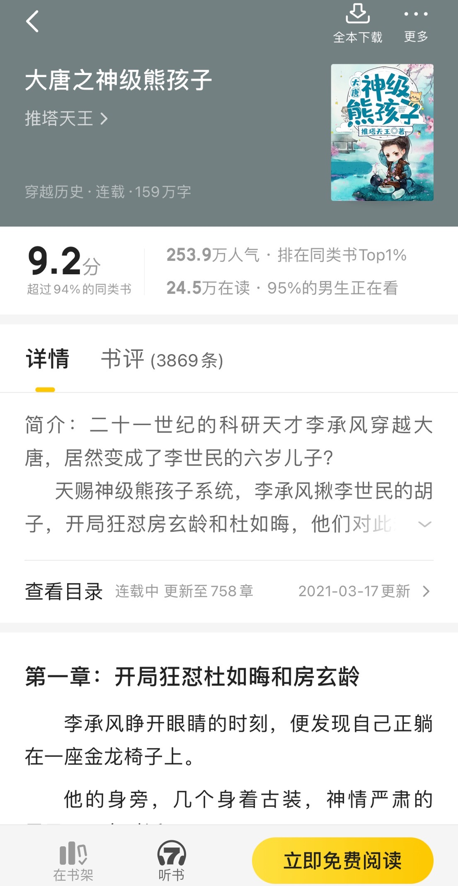
    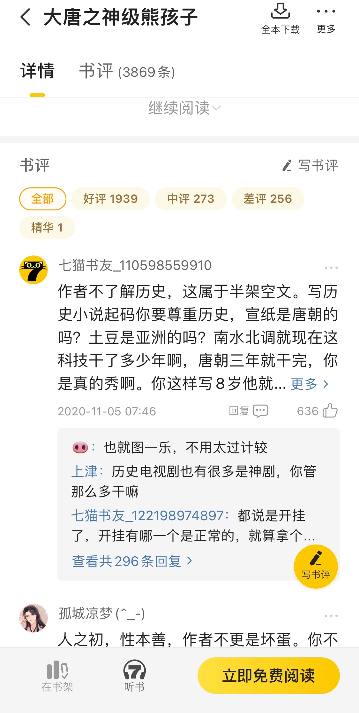
    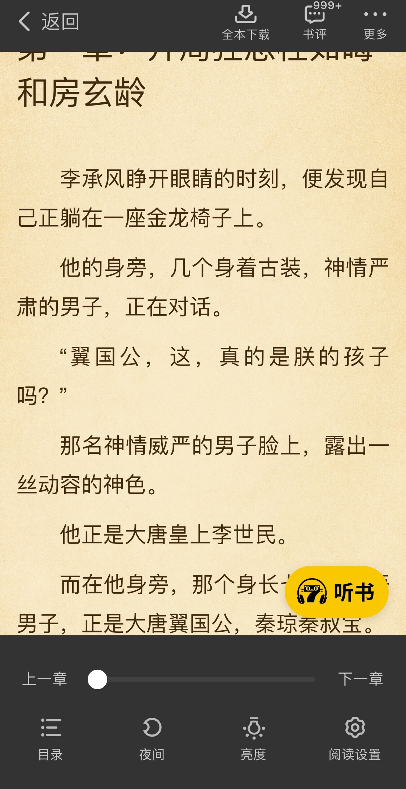
    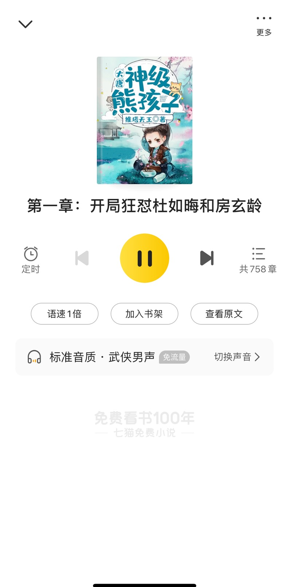

七猫小说与番茄小说第一层级的信息排列类似，都具有清晰的跳转逻辑。七猫小说在书籍评分模块，将书籍详细排名利用数字的形式体现出来，对用户更有冲击感，能够让用户直接了解到当前书籍的热度。并且在顶部banner栏作者部分，可以点击进入并查看当前作者的其他作品，方便吸引用户去阅读作者的其他书籍，对作者和用户都十分人性化。

##### 2.视觉和风格

番茄小说：

番茄小说的界面整体感觉方面比较清爽，信息排列较为松散，间距较大，缓解了繁杂的信息带来的压迫感，有利于提升用户体验。界面以浅灰色作为背景色，信息的聚合通过白色的色块来展示，并在当前选择的模块标签上加上了番茄色，来体现番茄小说的主题色彩。

七猫小说：

七猫小说相较于番茄小说，采用了黄白的颜色对比，并且书城页面采用了较多的banner展示，显得页面颜色更加丰富。但大量的信息聚合在书城页面，又添加了丰富的颜色，难免给人造成一种眼花缭乱、信息重点不突出的感觉。

书架界面，相比于番茄小说的仿真书架设计，七猫小说采用了信息流的形式展示，信息展示更加全面，但失去了仿真设计带来的体验感。

​	

##### 3.亮点功能和核心技术

核心功能方面，两个平台小说的分类都以性别为主要区分因素，基于该因素进行了两个设计：阅读偏好的选择以及书城页面书籍的分类显示，但该设计显得有些重复，有些女性分类下的书籍男性界面也会显示。

特色功能方面，番茄小说的视频推书是个亮点。视频广告和小说内容的推荐相结合是一个良好的发展方向。短视频可以直观、大信息量的呈现给用户想要了解的信息，其配音、配乐以及人物形象化都把小说的内容所丰富化，可以快速吸引用户的注意力。

而七猫小说专门为旗下的文学平台设立了单独的栏目，有助于其原创内容的生产、数字阅读、版权交易和出版发行的网络文学产业链布局。

### （三）、运营及商业化

##### 1.运营模式

两款在线阅读App都是主打“免费阅读+广告盈利”的模式，大量收入源于广告。免费阅读的模式可以下沉至三四线城镇，打开小镇市场。同时两款App都有福利功能，用户通过观看时长、拉新来获取现金奖励，大大促进了用户的增长与留存。

##### 2.盈利模式

番茄小说与七猫小说的盈利模式接近，主要通过站内广告收回，以会员模式作为补充。获客方式则是通过金币玩法以及各种渠道的投放。其商业模式逻辑可由下图大致表示

其中站内广告二者的方式也基本相同，一是通过阅读几页后的整体广告来实现；二是通过观看视频广告获得金币，或者免除阅读器的广告。

会员权益也基本相同，以无广告和金币奖励为主，其中番茄小说会员增加离线下载功能。

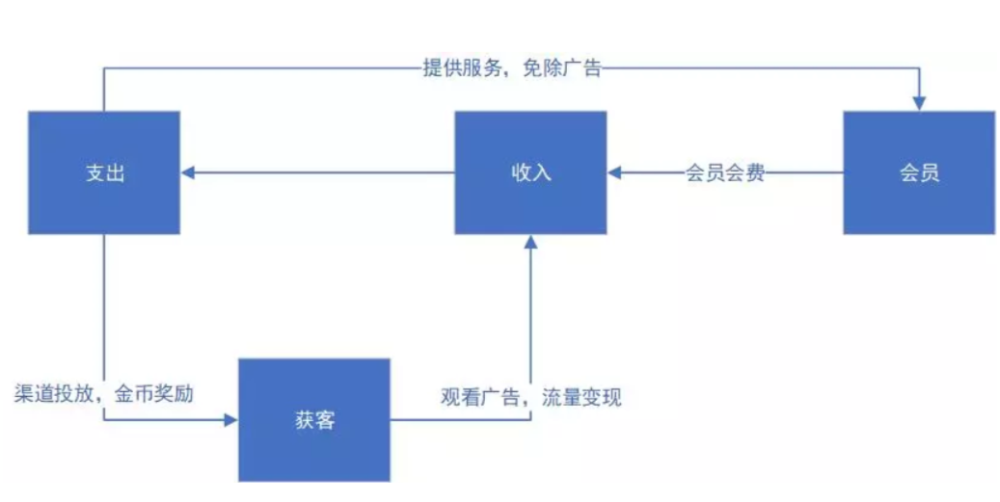

##### 3.市场推广

两者的业务模式也大致相同，通过合作渠道方的投放吸引用户，通过金币玩法、每日阅读任务、打卡模式、新手任务和阅读体验来留住用户，通过好友邀请机制实现用户的裂变增长。主要客户分为以下四类：小说阅读爱好者、想赚钱打发时间的普通用户、广告主、小说创作者。

### （四）、用户数据

##### 1.用户数量和活跃度

七猫小说：

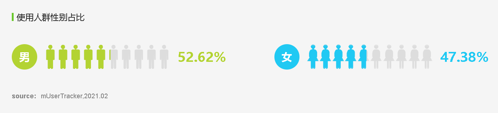

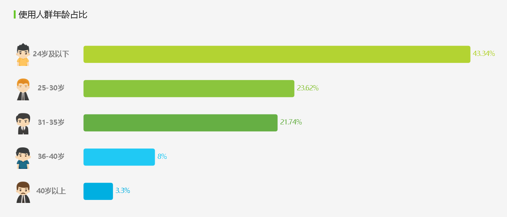

七猫小说：

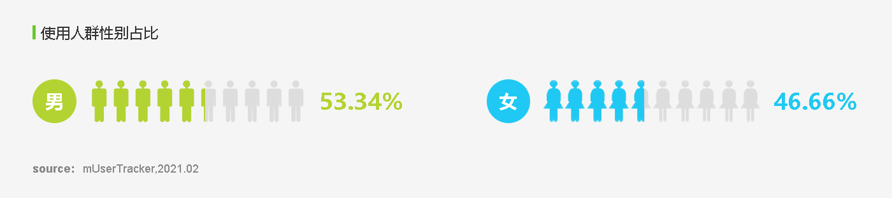

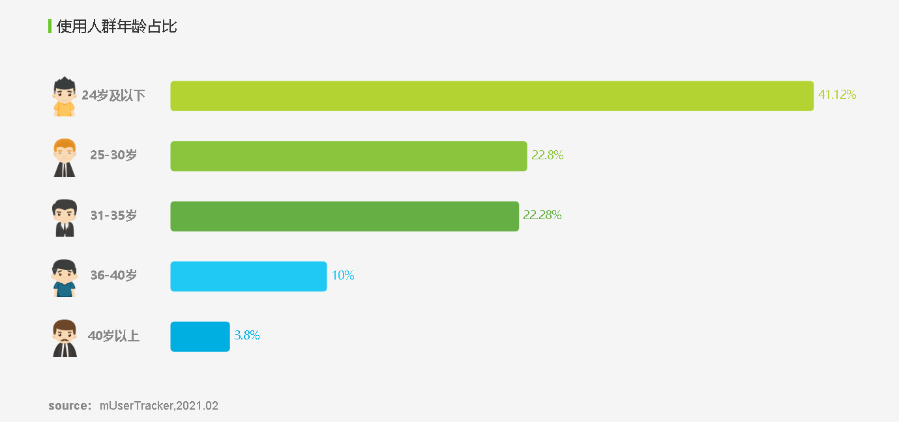

两款App用户在性别、使用人群年龄使用占比体现出高度的相似。七猫小说31-35岁用户略大于番茄小说。

##### 2.地域差异

番茄小说：

七猫小说：

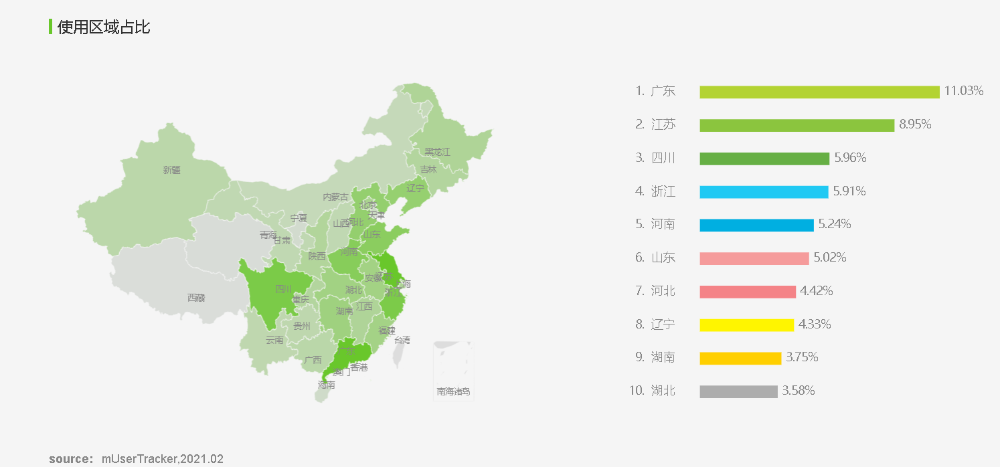

两款App的用户区域占比主要集中在中南部发达地区，说明经济条件较好的地区人们更加追求精神生活上的享受。

### （五）、核心策略分析

##### 1.版本迭代和演变

番茄小说

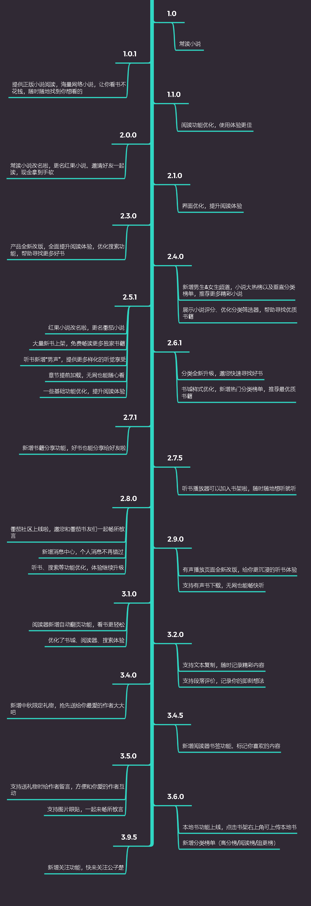

七猫小说：

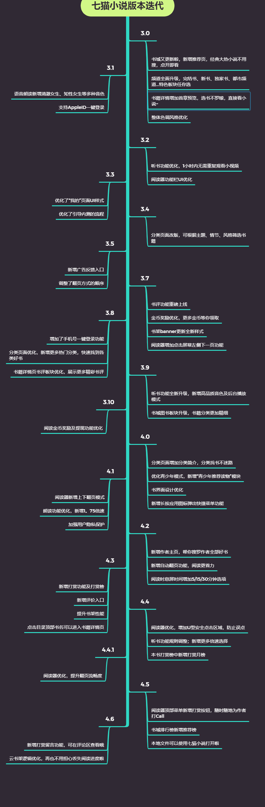

从番茄小说与七猫小说版本迭代信息中可以看到，两者的迭代功能与方向几乎一致，七猫小说在阅读器的优化以及书籍分类进行了多次更新升级，而番茄小说在社交书评功能模块优化更好。两者在书籍详情展示模块功能基本相似，但番茄小说推出了“视频推书”特色功能，能够更好向用户传递书籍信息。

### （六）、优缺点总结和借鉴

番茄小说：

番茄小说基于产品定位，准确设立了需求，并通过功能对需求进行了满足。其推出的“视频推书”、“新书阅读得金币“、”分享书籍“几个特色功能，属于用户的期望型功能，是该App具有竞争力的功能设计。同时番茄小说交互逻辑合理，页面排布与功能重点层级一致，UI设计简洁清爽。其劣势在于书籍的数量及内容的质量，以及福利的吸引能否使用户持续阅读。如果出现奖励更大的产品，是否还会保存现有的优势。

七猫小说：

七猫小说同样拥有精准的功能设计，满足目标人群的需求。其相较于番茄小说的劣势有：相较于番茄小说福利玩法不够丰富，并且信息架构比较繁杂，结合丰富的UI配色，降低了用户的使用愉悦度。同样，随着产品逐渐完善，以及其他竞品加入，平台需要提高奖励才能实现用户的留存。

## 四、总结

##### 1.SWOT分析

​	

|                                                              | Strength(优势) 1.产品页面简洁，产品信息架构清晰 2.高精准度的推荐算法，总能推荐给用户想看的内容 3.新兴的阅读方式，打开新兴商业模式 4.拥有自己独立原创平台，不断输送新的作品 5.拥有抖音、头条两个流量平台导流 | Weakness(弱势) 1.原创文学不足 2.高质量作品少 3.广告质量层次不齐，影响用户体验 4.内容单一，没有漫画等其它形式的书 5.功能单一，暂未与抖音、头条形成产品矩阵 |
| ------------------------------------------------------------ | ------------------------------------------------------------ | ------------------------------------------------------------ |
| **Opportunity(机会) 1.“免费+广告”的商业模式符合用户需求 2.国家政策大力支持文学文化的发展 3.国内免费小说市场依旧广阔，三四线城市用户量较少 4.拥有众多广告投放渠道 5.泛娱乐产业链日益完善** | **SO：优势+机会 增长型战略 1.继续下沉市场，挖掘三四线城市用户 2.利用好字节跳动其他App引流，优化完整体系** | **WO:弱势+机会 扭转型战略 1.优化广告内容，打造出适合在众多广告平台投放的广告内容，多形式多平台推送。 2.引进漫画等其它形式的内容** |
| **Threat(威胁) 1.优秀内容竞争激烈，国家政策越来越重视版权问题 2.老牌文学平台依旧是主流 3.社交类阅读产品也成为用户选择的移动阅读App 4.同类产品日益增加，且迭代迅速** | **ST:优势+威胁 多元化战略 1.利用自身内容，提高营销、设计与UI，与传统App打出差异化 2.不断挖掘优质原创内容与版权，打造优质的UGC内容社区。建立完整的产业链，扶持优质IP。发展多元化盈利结构。 3.引入更多优秀作品，名著等。** | **WT:弱势+威胁 防御性战略 1.继续优化应用功能，为用户提供更优质的服务 2.增大对目标群体的发展力度** |

##### 2.确定产品迭代方向

迭代方向1：完善自身作者培养方案，同时挖掘优秀IP和引进优质内容，丰富产业链。

迭代方向2：与抖音和头条形成产品矩阵，并优化打造适合多个平台投放的广告内容。

迭代方向3：丰富模块，可以发展社交模块，增加读者-读者，读者-作者之间更多社交方式。